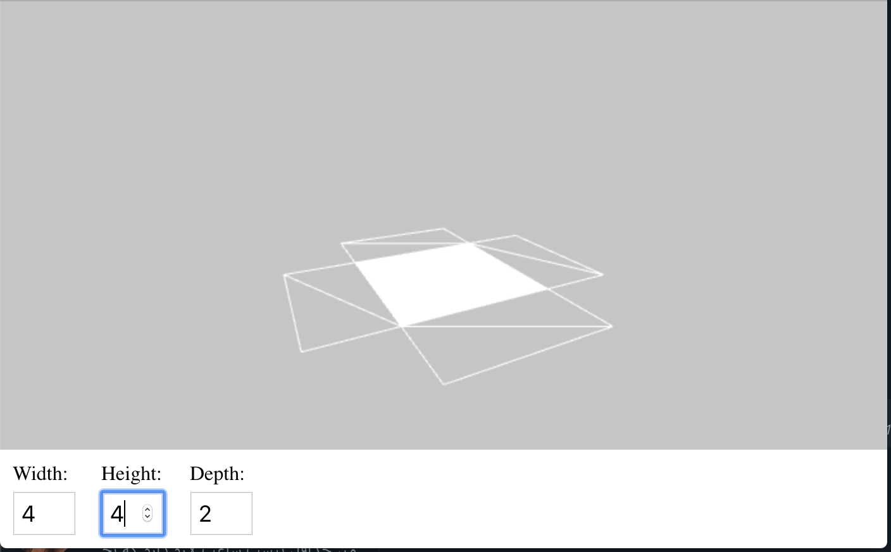
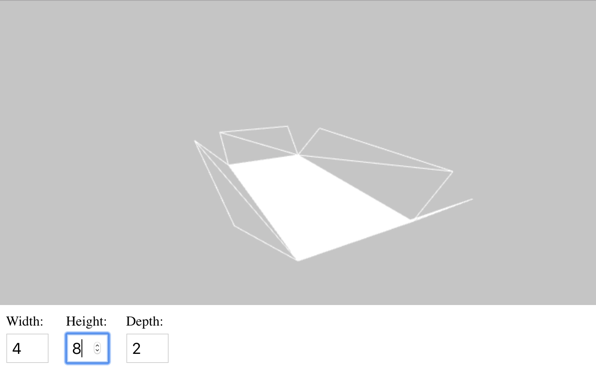

# ThreeJs box packaging

Are you looking for a way to demonstrate box packaging using ThreeJs inside Html? Here is a simple package opening and closing.

keywords:

Folding plan threejs, Folding box, Package folding, Box folding

## Live Demo

To see how it works:

https://torabian.github.io/threebox

## Support

If you like this project, or want to expand and use it please give us a call:

connexion.founder@outlook.com or +48 783 538 796

